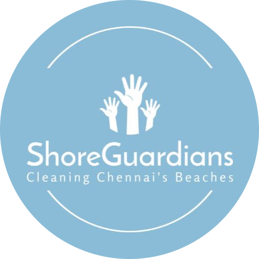

<p align="center">
  
</p>

### ShoreGuardians Website

This repository contains the code for the official website for ShoreGuardians, a beach cleanup club run by high-school students from across Chennai. The website serves as an informational platform for the club, showcasing our members, contact details, and more.

## Table of Contents

- [Technologies Used](#technologies-used)
- [Installation](#installation)
- [Contributing](#contributing)
- [Contact](#contact)

## Technologies Used

This project is built using the following technologies:

- **Vite.js**: Used for its fast build times and smooth developer experience.
- **Chakra UI**: For layout components, icons, and styling.
- **Google Apps Script**: To fetch Members' data from Google Sheets and Drive.

## Installation

Although this project is not meant to be run locally given its informational purpose, you may follow these steps if you wish to do so:

1. **Clone the repository:**

   ```bash
   git clone https://github.com/badhri-hari/shoreguardians-website.git
   ```

2. **Navigate to the project directory:**

   ```bash
   cd shoreguardians
   ```

2. **Open the local dev environment:**

   ```node
   npm run dev
   ```
   
4. **Navigate to "localhost:5173" in your preferred browser.**

## Contributing

Contributions are not expected. However, if you are part of the future ShoreGuardians web development team and would like to suggest improvements, feel free to fork the repository and create pull requests.

## Contact

For any inquiries related to this project, please contact:

- **Badhri Hari:** badhrihari123@gmail.com
